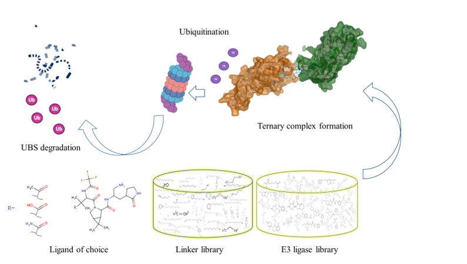
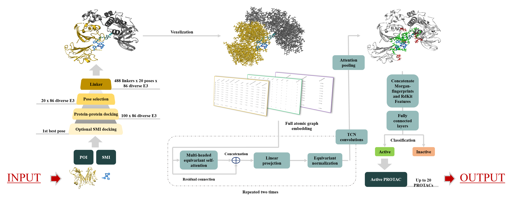

# PROTACable


PROTACable is an end-to-end in-silico design toolkit for novel PROTACs

## Table of Contents

- [Preliminary](#preliminary)
- [Requirements](#requirements)
- [Installation](#installation)
- [Usage](#usage)
- [Stage I: Docking POI and Elaborating Variations](#stage-1-docking-poi-and-elaborating-variations)
- [Stage II: POI-E3 Docking and Pose Filtering](#stage-2-poi-e3-docking-and-pose-filtering)
- [Stage III: Linker Ligation and Pose Filtering](#stage-3-linker-ligation-and-pose-filtering)
- [Stage IV: SE(3) Transformer Network Score Prediction](#stage-4-se-3-transformer-network-score-prediction)
- [Stage V: Ternary Complex Minimization](#stage-5-ternary-complex-minimization)
- [References](#references)
- [License](#license)
- [Citation](#citation)

## Preliminary

The concept of an end-to-end in silico pipeline is quite enticing. You may only find it in biotech specialized for this type of task. Now we offer this to the public as an accessible package. Yes, you can now design and validate in silico your PROTACs with limited knowledge of PROTACs. And you can do it affordably and at a high quality similar to high-end companies. This is the culmination of 3 years of dedicated work. 

#### ***We kindly ask you that if you find this pipeline useful to cite us appropriately.***



Architecture of the PROTACable pipeline.

## Requirements

Different stages of PROTACable pipeline have variable set of requirements.
### Conda environment:
* See [Installation](#installation) below.
### Linux OS:
* This toolkit collection had been tested on Centos 8 OS.
* SLURM scheduler 
### Software:
* Stage 1: GNINA v1.0 (optional).
* Stage 2: ProPOSE v2022. (Mandatory)
* Stage 5: Maestro PrepWizard (optional and preferred to have for final structure relaxation).
> **Note:** You can replace the PrepWizard with any other preferred tool for performing structure minimization.

### Hardware:
* CUDA >= 11.0 (optional)


## Installation

To get started with PROTACable, follow these instructions:

```
git clone https://github.com/giaguaro/PROTACable.git 
cd PROTACable
export PROTACable=${pwd}
```
> **Note:** You need to have the environment variable defined at all times during running any part of the code.

### Conda environment:

```
conda env create -f PROTACable.yml
```
> [Follow NVIDIA's instructions](https://docs.nvidia.com/cuda/cuda-installation-guide-linux/#axzz4TWipdwX1) to install the latest version of CUDA (>= 11.0 is required). Make sure `nvcc` is in your PATH.

You may also refer to manually to setup of the environemnt: [Pkgs installation](pkgs_installation.txt)

### Software:

- **GNINA**: Refer to GNINA official repository - https://github.com/gnina/gnina
  
Once GNINA is installed place it in the ```PROTACable_stage_1/utilities``` directory.
 
- **ProPOSE**: Refer to ProPOSE official website for academic licensing - https://mm.nrc-cnrc.gc.ca/ccbpub/propose_main.php

Once ProPOSE software and license is obtained place them in the ```PROTACable_stage_2/ProPOSE``` directory.

*Preferred*

- **Maestro**: Refer to Maestro official website for download and tokens - https://www.schrodinger.com/products/maestro

Only Maestro's PrepWizard will be used and will be used only in Stage 5. This tool will serve the purpose of minimization of the selected ternary complexes modelled throughout the pipeline. 

- **SLURM**: You need to modify `${PROTACable}/PROTACable_stage_III/submit_jobs.sh` and `${PROTACable}/PROTACable_stage_II/bash_propose.sh` for appropriate node partition and other SLURM scheduler settings.

## Usage

Due to the complexity of the pipeline, each stage was kept operating separately such that there is a finer control over the output before the subsequent stage is activated. The majority of the stages in the pipeline do more than one task. To get familiar with the tasks refer to our paper.

First, you need to define the PROTACable environment:

```
export PROTACable=/path/to/PROTACable/directory
```

Commence with a new directory where you have the necessary pre-requisites: 

* POI in PDB format
* Ligand in PDB or SDF format

### Stage 1: Docking POI and Elaborating Variations

This stage is broken into two parts: docking and creating R-group variations for linker ligation.

+ You can optionally dock your POI with the cognate ligand (if it's not already complexed with the ligand pose):

```
sh $PROTACable/PROTACable_stage_1/dock_poi.sh -i <input PDB file> -l <input ligand in SDF format> -w <number of workers>
```

+ It is recommended to generate variations of the R-group for linker ligation using the docked PDB ligand (generated from above) or by extracting it from an existing PDB file of the POI-Lig complex. You can generated variations programmatically using the PDB file of the ligand and an exit vector. The exit vector here refers to the index which corresponds to the atom you want the linker to be attached to. 

```
python $PROTACable/PROTACable_stage_1/make_variations.py <ligand in PDB format> <exit vector> <output prefix>
```
> **Tip:** Once you decide on the atom you think is apt for linker ligation (usually an atom that is in maximally solvent exposed moiety), you may take note of the atom number (atom label). You can then find the corresponding index by opening the PDB file in a text viewer and locating the atom with the sought atom number. The exit vector will be exactly that atom's serial number. Refer to [PDB format guide](https://www.biostat.jhsph.edu/~iruczins/teaching/260.655/links/pdbformat.pdf) for further clarification.

This will generate two variations with carboxyl ```C(=O)O``` ${outout_prefix}_carboxyl.pdb and amide ```C(=O)N``` ${outout_prefix}_amide.pdb files as well the original unmodified ligand pose ${outout_prefix}_original.pdb.

Next, you need to "radiolabel" the POI such that the exit vector is updated to reflect the new linker attachment site. The new exit vector for the amide and carboxyl variations are usually the last atom in the HETATM records.

```
python $PROTACable/PROTACable_stage_1/radiolabel_poi.py <pdb_file_path> <exit_vector_index> 
```

### Stage 2: POI-E3 Docking and Pose Filtering

Once you have the R-group added and the "radiolabel" assigned, you may choose all of the variations to proceed with. However, due to the high computational requirement of this stage, it is recommended that you abide with one of the variations such as the amide R-group. 

Start by combining the variation ligand with the POI:

```
grep "^HETATM" POI_Lig_amide.pdb > POI_Lig_amide_clean.pdb
grep "^ATOM" POI.pdb > POI_clean.pdb
cat POI_Lig_amide_clean.pdb POI_clean.pdb >> POI_Lig_amide_complex.pdb
```

Now you can issue the docking commands:

```
sbatch $PROTACable/PROTACable_stage_2/main.sh -P POI_Lig_amide_complex.pdb
```

This will generate a ```ternaries``` directory with different E3 ligase - Ligand complex docking solutions. 

> **Note:** The E3 library is pre-prepared and contains 86 unique E3 ligase-ligand complexes. Nevertheless, most of the diversity in the E3 ligase library comes from the ligands variations. 

### Stage 3: Linker Ligation and Pose Filtering

From the previous step you should have a ```ternaries``` directory with 86 subdirectories - each containing 20 filtered PROTAC-productive poses. 

We can now proceed with linker ligation. A library of 1236 linkers will be leveraged to attempt linker bridging between the POI and E3 cognate ligands for each of the 86 E3 ligase variation. In the process, many linkers will fail candidacy because the 'unlinked' ternary complex does not provide a feasible path for those linkers. 

Very simply, you can issue this command:

```
sh $PROTACable/PROTACable_stage_3/main.sh /path/to/ternaries/directory
```

The resulting shortlisted ternary complexes will be stored in ```ternaries/output_stage_3_4/```

### Stage 4: SE(3) Transformer Network Score Prediction

We are ready to predict the scores of the resulting ternary complexes using the pre-trained SE(3) transformer:

```
sh $PROTACable/PROTACable_stage_4/main.sh /path/to/ternaries/output_stage_3_4/
```

A ```predictions_and_targets.csv``` will be saved in ```ternaries/output_stage_3_4/``` detailling the probability each ternary complex is active.

In addition, the top 20 sorted predictions are saved in ```ternaries/top_ternaries_results```

### Stage 5: Ternary Complex Minimization

The final step is essential if you want a sound looking ternary complex. We rely on Maestro's PrepWizard tool to optimize the path for the linker that connects both POI and E3:

```
sh $PROTACable/PROTACable_stage_5/minimize_with_prepwizrd.sh /path/to/top_ternaries_results
```

The final results will be stored in ```ternaries_minimized```

This marks the end of the PROTACable modelling pipeline. 


## References

1. McNutt, A.T., Francoeur, P., Aggarwal, R. et al. GNINA 1.0: molecular docking with deep learning. J Cheminform 13, 43 (2021). [Link to paper](https://doi.org/10.1186/s13321-021-00522-2).
2. Hogues, Hervé, et al. “ProPOSE: Direct Exhaustive Protein–Protein Docking with Side Chain Flexibility.” Journal of Chemical Theory and Computation, vol. 14, no. 9, 2018, pp. 4938–47.[Link to paper](https://doi.org/10.1021/acs.jctc.8b00225)

## License

This project is licensed under the GNU General Public License v3.0 - see the [LICENSE](LICENSE) file for details.

### Citation

Hazem Mslati, Francesco Gentile, Mohit Pandey, Fuqiang Ban, Artem Cherkasov. "PROTACable: An Integrative Computational Pipeline of 3-D Modeling and Deep Learning to Automate the De Novo Design of PROTACs." *bioRxiv* (2023). doi: [10.1101/2023.11.20.567951](https://doi.org/10.1101/2023.11.20.567951).

